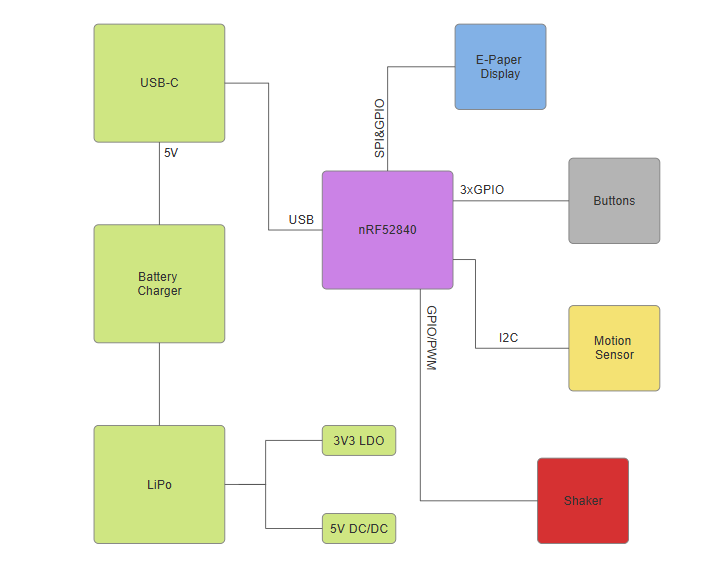

# ⌚ "InkTime smartwatch" - PCB layout in Fusion 360
InkTime is an e-paper smartwatch designed for month-class battery life, sunlight-readable time-first UX, and essential phone notifications with basic activity
tracking.
Developed in Autodesk Fusion 360, the PCB layout adheres to the precise dimensions and mounting requirements of the wearable chassis, ensuring a seamless fit and optimal component placement.

## Hardware Diagram

This is an open-hardware wearable based on the nRF52840 microcontroller.

---

## System Architecture

### 1. Microcontroller (MCU)
- **Chip:** Nordic nRF52840 (Cortex-M4F @ 64MHz)
- **Memory:** 1MB Flash, 256KB RAM
- **Radio:** Bluetooth 5.4 Low Energy with integrated ceramic antenna
- **Oscillators:** 32MHz (operational) and 32.768kHz (sleep mode/RTC)

### 2. Power Management
- **Li-Po Charger:** BQ25180 (I2C control, programmable current)
- **Voltage Regulator:** RT6100 Buck-Boost (stable 3.3V output)
- **Battery Monitoring:** MAX17048 Fuel Gauge (ModelGauge algorithm)
- **Charging Interface:** USB-C with USBLC6-2 ESD protection

### 3. Display (E-Paper)
- **Type:** Electronic Paper Display (EPD)
- **Interface:** SPI + Power Gating Control (PWR_EPD)
- **Drive Circuit:** On-board integrated Boost converter (MBR0530 Diodes, L5 10uH) for VGH/VGL generation

### 4. Sensors and Feedback
- **IMU:** BMA421 (Ultra-low power accelerometer connected via I2C)
- **Haptic:** DRV2605 (Vibration driver with integrated effects library via I2C)
- **Input:** 3 mechanical buttons (UP, ENTER, DOWN) with filtering circuits

### 5. Communication Interfaces (I2C Mapping)
| Component | Function | Interface |
| :--- | :--- | :--- |
| **BMA421** | Motion Sensor | I2C |
| **MAX17048** | Battery Status | I2C |
| **DRV2605** | Vibration Motor | I2C |
| **BQ25180** | Charging | I2C |

---

## Debug and Programming
- **SWD:** Programming and debugging via Tag-Connect TC2030 connector
- **USB:** Serial communication and charging

---

## nRF52840 Pin Mapping

| Pin nRF52840 | Signal      | Component | Interface |
|-------------|------------|------------|----------|
| P0.00/XL1   | XL1        | Crystal X2 (32.768kHz) | XTAL |
| P0.01/XL2   | XL2        | Crystal X2 (32.768kHz) | XTAL |
| P0.05/AIN3  | EPD_CS     | E-Paper (J1 FPC) | SPI CS |
| P0.06       | SDA        | BMA423, BQ25180, MAX17048, DRV2605 | I2C SDA |
| P0.07       | SCL        | BMA423, BQ25180, MAX17048, DRV2605 | I2C SCL |
| P0.08       | IMU_INT1   | BMA423 | GPIO Input |
| P1.08       | IMU_INT2   | BMA423 | GPIO Input |
| P0.11       | PMIC_INT   | BQ25180 | GPIO Input |
| P0.12       | HAPTIC_EN  | DRV2605 | GPIO |
| VBUS        | VBUS       | USB-C (J4) | Power |
| D-          | D-         | USB-C (J4) / USBLC6 | USB |
| D+          | D+         | USB-C (J4) / USBLC6 | USB |
| P0.13       | SW_UP      | Buton Up | GPIO Input |
| P0.14       | SW_ENT     | Buton Enter | GPIO Input |
| P0.15       | EPD_DC     | E-Paper (J1 FPC) | SPI DC |
| P0.16       | EPD_RST    | E-Paper (J1 FPC) | GPIO |
| P0.17       | EPD_BUSY   | E-Paper (J1 FPC) | GPIO Input |
| P0.18/RESET | RESET      | TC2030-IDC | SWD/GPIO |
| SWDCLK      | SWDCLK     | TC2030-IDC | SWD |
| SWDIO       | SWDIO      | TC2030-IDC | SWD |
| P1.02       | SW_DN      | Buton Down | GPIO Input |
| P0.10/NFC2  | ALERT      | MAX17048 | GPIO Input |
| ANT         | RF         | Antena 2450AT18B100E | RF |
| P0.02/AIN0  | SCK        | E-Paper (J1 FPC) | SPI SCK |
| P0.03/AIN1  | MOSI       | E-Paper (J1 FPC) | SPI MOSI |

---

## Power Consumption and Battery Life

The device is optimized for ultra-low power operation, leveraging the nRF52840's sleep states and power-gating techniques for high-voltage peripherals.

### Estimated Current Consumption
| Operating Mode | Active Components | Estimated Current |
| :--- | :--- | :--- |
| **Deep Sleep** | MCU (System OFF), Fuel Gauge (Sleep) | ~10 µA |
| **Standby (Idle)** | MCU (System ON), IMU (Low-power) | ~0.8 mA |
| **EPD Refresh** | MCU, EPD Boost Circuit, Display | ~12 mA (peak) |
| **Haptic Alert** | MCU, Haptic Driver + Motor | ~80 mA (peak) |

---

## Design Log

This section outlines the PCB design process, key implementation decisions, and adherence to project constraints.

### Component Placement Strategy
The layout prioritized mechanically constrained and critical components to ensure seamless integration with the watch enclosure:
* **Primary I/O:** USB-C connector, side tactile buttons, and E-paper FPC connector.
* **Core:** nRF52840 MCU.

All components are placed **strictly on the TOP layer**. Passive components (resistors/capacitors) were distributed around their respective ICs to minimize trace length, with **100nF decoupling capacitors** positioned immediately adjacent to power pins for optimal noise suppression.

### Routing & Stack-up
The design utilizes a **2-layer stack-up** where both Top and Bottom layers carry signals, power, and ground planes.
* **Power Traces:** Width ≥ 0.3 mm.
* **Signal Traces:** Width ≥ 0.15 mm.
* **Geometry:** Strictly 45° or smooth mitered angles; no 90° bends.

### Grounding & EMI Management
* **Ground Planes:** Solid polygon pours implemented on both layers.
* **RF Integrity:** A strict keep-out zone was maintained around the ceramic antenna (no copper, traces, or vias) in the board corner.
* **Inductor Placement:** L2 and L3 are oriented perpendicularly to minimize mutual magnetic interference.

### Component Constraints & Manufacturing
Adherence to specified footprint requirements:
* **Resistors:** 0201.
* **Capacitors:** 0201 (≤ 100nF) / 0402 (> 100nF).
* **Design Rule Exceptions:** Via drill size DRC errors were manually audited and approved based on manufacturing capabilities.

### Battery Life Estimation
Based on a **200mAh** Li-Po battery:
- **Static Time (Always-on):** Over 1 year (EPD retains the image without power).
- **Typical Usage:** ~10-12 days (with BLE active and 1 refresh/hour).
- **Heavy Usage:** ~4-5 days (frequent haptic notifications and updates).
